# Features

Many of these changes were made to Polished Crystal 3.0.0. 

## Custom Features to Inheritance

* New region: Historic Johto
* Custom Pokédex of 254 includes Sinnoh and Hisui Pokémon, including 2 fakemon: Noctowl and Minsir 
* New apricorn system to craft new Pokéballs
* Emphasis on overworld puzzles exploiting time travel mechanic 
* "Trick House" in historic Ilex Forest
* Two possible endings

## Pokémon

* The entire Pokédex can be caught in one game. 
* See FAQ for unique evolutions. 

## Moves

* Learnsets have been updated close to Gen VI, with missing moves replaced by similar, egg, TM, or event-exclusive moves. See data/pokemon/evos_attacks or data/pokemon/base_stats/<name> for level-up and TMHM learnsets.
* HM moves do not require move deleter to overwrite.

## Graphics Mechanics

* Pokemon with the highest possible DVs for each hidden power type will take on a unique sprite palette. There are six NPCs who can change the DVs of the first Pokemon in your party: The Celebi Puzzle Word Room (unlocked when you solve the puzzle); National Park; Violet City; Whirl Islands; Tin Tower; and Lake of Rage. 

## Custom Features to Inheritance

* New region: Historic Johto
* Custom Pokédex of 254 includes Sinnoh and Hisui Pokémon, including 2 fakemon: Noctowl and Minsir 
* New apricorn system to craft new Pokéballs
* Emphasis on overworld puzzles exploiting time travel mechanic 
* "Trick House" in historic Ilex Forest
* Two possible endings

## Notable features carried from Polished Crystal 3.0.0

* Modern techniques
* New mechanics, including the Fairy type, Physical/Special split, Natures, unlimited TMs, Running Shoes, and continuous Repel.
* Music and graphics devamped from other versions.
* Nuzlocke mode in the Option menu, enabling the basic rules of the [Nuzlocke Challenge](http://bulbapedia.bulbagarden.net/wiki/Nuzlocke_Challenge).
* Learnsets have been updated close to Gen VI, with missing moves replaced by similar, egg, TM, or event-exclusive moves. See data/pokemon/evos_attacks or data/pokemon/base_stats/<name> for level-up and TMHM learnsets.
* HM moves do not require move deleter to overwrite.
* Hold B to use Running Shoes, or turn on the Option to always use them.
* Continuous Repel system.
* Cure poison when it reaches 1 HP outside a battle.
* Eggs hatch at level 1.
* Surf at Bicycle/Running Shoes speed.
* Maximum $9,999,999 money and 50,000 coins.
* Maximum 30 items and 16 Balls in your bag pocket.

## Screenshots

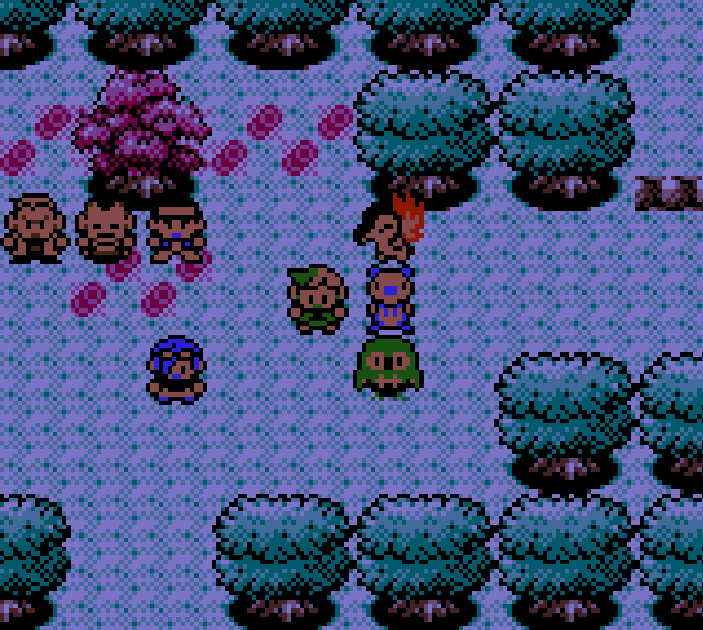

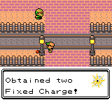 

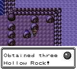 

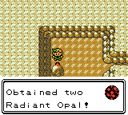 

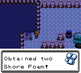 

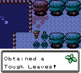 

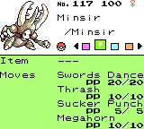 

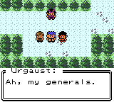 

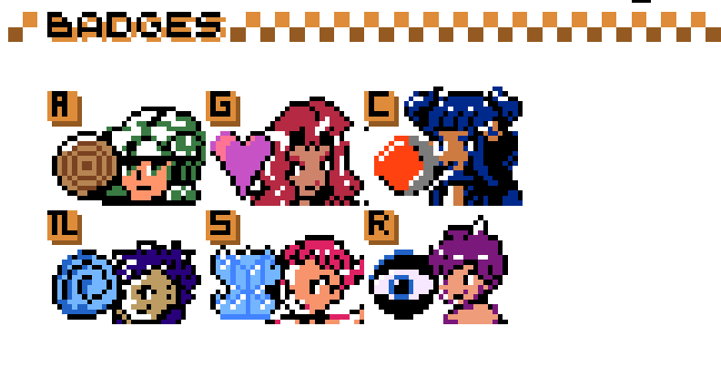 

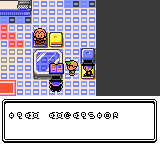 

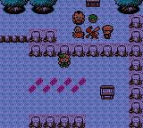 

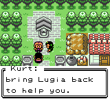 

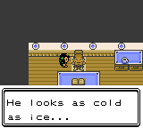 

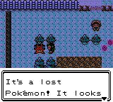 

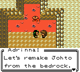 

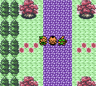 

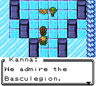 

; todo 
New Colors

Debug Room (Spoiler)

Example format below: 
 ; (screenshots/gameplay/<file_name>.png)

## New Hidden Power Colors

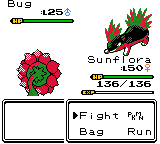 
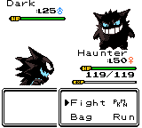 
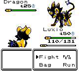 
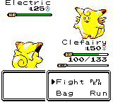 
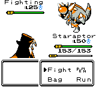 
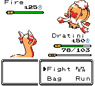 
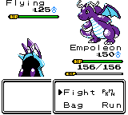 
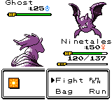 
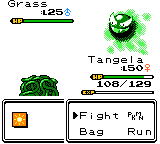 
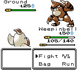 
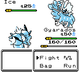 
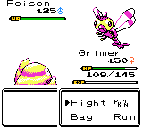 
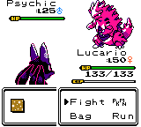 
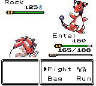 
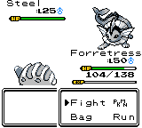 
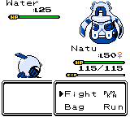 

## Spotify Playlist

Curated playlist: https://open.spotify.com/playlist/1yUCVhCgMnO10MIXvMtyh4?si=fc0b8107a7724a80

##Features from Polished Crystal 3.0.0

## Battle Mechanics

* The Fairy type, with the Pink Bow as its type-enhancing item.
* Type chart, base stats, and move attributes all updated to Gen VI.
* Physical/Special/Status split.
* Natures (determined from DVs since personality values don't exist in Gen II) thanks to FredrIQ.
* Gain experience from catching Pokémon.
* Play low-pitched cries when a player or foe Pokémon faints.
* Money loss formula from Gen V.
* Shiny Pokémon now have an odd Attack DV, 2, 3, 7, or 11 Defense, 5 or 13 Speed, and a perfect 15 Special; so 1 in 1,024 Pokémon is shiny.
* Type-enhancing items raise by 20%, not 10%.
* Light Ball doubles Pikachu's Attack as well as Special Attack.
* Critical hits do 150% damage, not 200%, but are more likely.
* Electric-type Pokémon are immune to paralysis, even from Tri Attack.
* Ice-type Pokémon are immune to freezing, even from Tri Attack.
* Fire-type Pokémon are immune to burns, even from Tri Attack.
* Steel-type Pokémon are immune to poisoning.
* Poison-type Pokémon always hit with Toxic.
* Curse is Ghost-type.
* Roar, Whirlwind, and Struggle are unaffected by accuracy or evasion, like Swift.
* Growth raises Attack and Special Attack, by two stages in sunlight.
* Hidden Power is always 70 power.
* Double-Edge and Flare Blitz do 33% recoil damage.
* Twineedle checks for poison after each hit.
* Sandstorm does 1/16 damage per turn.
* Substitute blocks Transform, Swagger, and trapping moves; does not block draining moves; and prevents gaining money from Pay Day.
* Protect works from behind a Substitute.
* Struggle does 25% of max HP recoil damage.
* Sleep lasts 1-3 turns, not 1-7.
* 20% chance to defrost each turn, not 10%.
* Disable lasts for 4 turns.
* Waterfall has a 20% flinch chance.
* X Accuracy boosts accuracy, it does not ignore accuracy checks entirely.
* Leppa Berry (formerly MysteryBerry) restores 10 PP, not 5.
* Sitrus Berry (formerly Gold Berry) restores 25% of max HP, not 30 HP.
* Paralyze and Freeze animations play each turn.
* Rock-type Pokémon get Sp.Def boosted by 50% in a sandstorm.
* Wild Pokémon have more common held items (50% chance for a common one and 5% for a rare one). Giving an Amulet Coin to your lead Pokémon increases this to 60% and 10%.

## Overworld Mechanics

* Hold B to use Running Shoes, or turn on the Option to always use them.
* Unlimited-use TMs.
* Continuous Repel system.
* Cure poison when it reaches 1 HP outside a battle.
* Eggs hatch at level 1.
* Trees randomly give 1, 2, or 3 Berries.
* Surf at Bicycle/Running Shoes speed.
* Maximum $9,999,999 money and 50,000 coins.
* Maximum 30 items and 16 Balls in your bag pocket.

## Nuzlocke Mode

* Available in the Option menu at any time.
* A fainted Pokémon can't be revived, by items, Pokémon Centers, or events. The only exception is your first rival battle, when you just have your starter. (Also when you deposit them into the PC, since current HP is not stored.)
* You can only catch the first Pokémon you encounter in a new location. "Location" is defined with the Town Map mechanics, so Sprout Tower is separate from Violet City, but multiple floors of Union Cave or multiple sections of the Safari Zone count as one location. And nothing is counted until you receive your first five Poké Balls.
* Every Pokémon gets a nickname, no asking whether you want to or not. Of course, you can cancel out to give the default name.
* The dupes clause is in effect. If you've caught a Pidgey and encounter one on a new route, it won't count unless you catch it.
* The shiny clause is also in effect. Shinies can always be caught.
* Gift Pokémon do not count as encounters. Static encounters like Sudowoodo, Snorlax, and Suicune do.

## Events

* Random Wonder Trades in the Goldenrod PokéCom Center, including random held items and original trainers.
* Move Reminder in the same house as the Move Deleter. (Code borrowed from TPP Anniversary Crystal, thanks to its developers graciously making [their source code](https://github.com/TwitchPlaysPokemon/tppcrystal251pub/) public.)
* Revised Game Corner prizes.
* Revised Buena's Password prizes.
* Three of Prof. Oak's aides give you items as you complete the Pokédex.
* Type boosting items given early on, if you can find the right Pokémon.

## Trainers

* Kurt will battle you for extra experience throughout the game to help you get locations for rare Pokémon. 

## Items

* New Pokéballs: Bub Ball, Herb Ball, Deci Ball, Jeze Ball, and Geode crafted from materials on the overworld.

## Bug Fixes from Crystal Version (2000)

* Dragon Fang boosts Dragon-type moves, not Dragon Scale.
* Burn/Poison/Paralyze improve catch rate.
* Love Ball catches opposite sex and raises happiness.
* Fast Ball catches flee-prone Pokémon.
* Medium-Slow growth rate experience underflow at level 1.
* HP bar lowers at the same speed even for high HP.
* Belly Drum needs to cut HP to raise Attack.

## Difficulty

* Default Set battle style.
* Enemy AI doesn't fail an extra 25% of the time with sleep or poison-inducing moves, or 40% of the time with stat drops.
* No badge boosts to stats or types.
* AI improvements, such as not trying to paralyze Electric types or burn Fire types.

## Changes and Buffs

### Pokémon

* Many base stat changes, mostly based on [Drayano's Sacred Gold/Storm Silver](https://gbatemp.net/threads/pok%C3%A9mon-sacred-gold-storm-silver.327567/).
* Octillery is Water/Fire. 
* Electivire is Electric/Fighting.
* Mismagius is Ghost/Fairy.
* Meganium is Grass/Fairy.
* Ninetales is Fire/Psychic. (Inheritance exclusive)
* Sunflora is Grass/Fire. (Inheritance exclusive)
* Vileplume is Grass/Dark.  (Inheritance exclusive)
* Lugia has Drizzle ability.  (Inheritance exclusive)

### Moves

* HM moves are forgettable at any time. 
* Cut is Steel-type, 60 power, 100% accuracy.
* Fly has 100% accuracy.
* Strength is 90 power fighting-type. 
* Rock Smash has 75 power.
* Fire Spin has 90% accuracy. 
* Whirlpool is Psychic-type Bulldoze and can be learned by most Water, Psychic, Ghost, and Fairy types. 
* Hail boosts Defense of Ice-types by 50%.
* Submission and Take Down have 90 power, 100% accuracy, and 15 PP to match Wild Charge.
* Crabhammer and Octazooka have 95% accuracy.
* Sing has 75% accuracy to match Lovely Kiss.
* Supersonic has 65% accuracy and 20 PP.
* Hidden Power is ???-type and has 70 power.
* Metronome is ???-type.
* Pain Split is Ghost-type.

## Graphics and Music

* Restored original Japanese sprites for Beauty, Fisher, Medium, Sage, and Swimmer♀.
* Replaced Twins sprite with a devamped one from B/W.
* New music ported from RBY and devamped from future generations.
* Unique mini sprites for each Pokémon (thanks to [this patch](http://www.pokecommunity.com/showthread.php?t=338470)).
* Revised some shiny palettes (Dragonite is blue like Dragonair, Nidoqueen is pink like Nidoking, Scizor is silver, Espeon is sky blue, Electabuzz is red, etc).
* Item balls for TMs are blue (inspired by Gen VI's yellow).

## More Tweaks

* Lowercase Pokémon, moves, items, types, names, etc.
* Fast text by default.
* Stereo sound by default.
* Third Trainer Card page for Kanto badges.
* Fourth stats page for capture data formerly told by the Poké Seer.
* Move stats include type, category, power, and accuracy.
* Updated language (Pack → Bag, Enemy → Foe, Cooltrainer → Ace Trainer, Fisher → Fisherman, Elixer → Elixir, Pink Bow → Silk Scarf, new Berry names, etc).
* Fishing works 75% of the time, not 50%.
* Nidorina and Nidoqueen can breed, and will produce eggs of either Nidoran gender.
* Always show numbers in Pokédex, even in Johto order.
